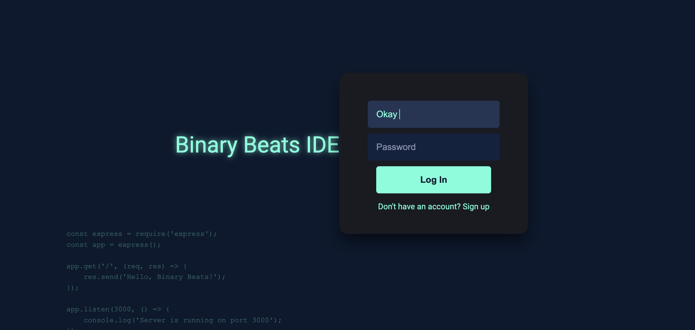
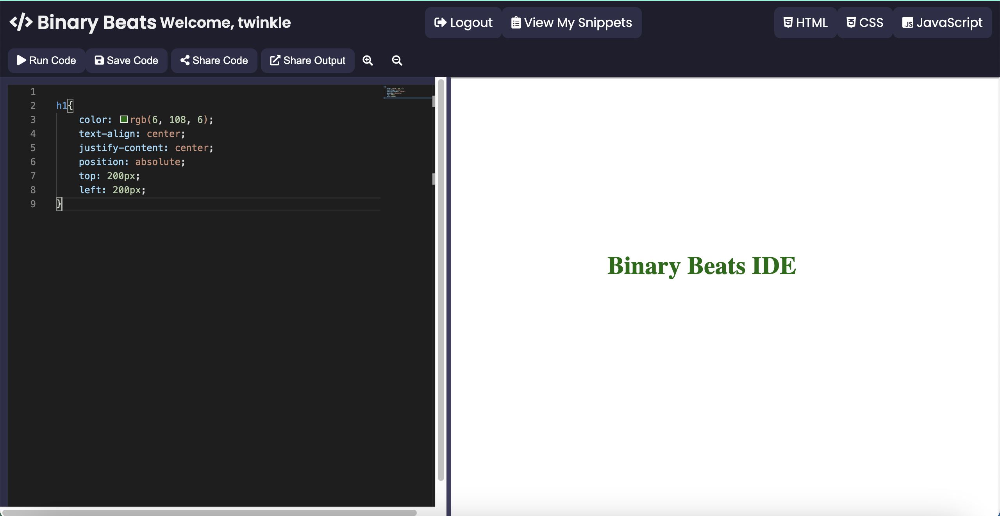

# Binary Beats IDE

Binary Beats IDE is an intuitive, powerful, online integrated development environment (IDE) designed to offer an accessible, seamless coding experience. Dive into our web-based editor for an unmatched coding journey, whether you're a beginner or a seasoned developer.

## Features ✨

- 📝 Edit HTML, CSS, and JavaScript in real-time
- 🚀 Run code snippets with a single click
- 💾 Save your progress and return anytime
- 🌐 Share your code with others through unique URLs

## Getting Started 🚀

To start using Binary Beats IDE, visit [Binary Beats](https://codesage.pythonanywhere.com) and log in with your credentials.

Experience a sleek, distraction-free coding interface:

## How to Use 🛠️

1. **Login/Register**: Access your personal workspace by logging in or registering.
2. **Write Code**: Choose between HTML, CSS, and JavaScript tabs to write your code.
3. **Run Code**: Use the 'Run Code' button to see your code come to life in the output pane.
4. **Save Snippets**: Click 'Save Code' to save your current work.
5. **Share**: Generate shareable links to showcase your work with others.

## Contributions

Want to contribute? Great! Feel free to fork the repo, add your changes, and open a pull request.

## License

Distributed under the MIT License. See `LICENSE` for more information.

## Connect with Us

Got questions or suggestions? Reach out to us on:

- [GitHub](your-github-profile-url)
- [Twitter](your-twitter-profile-url)
- [LinkedIn](https://linkedin.com/in/mhridoy)

---

Made with ❤️ by [Binary Beats](https://codesage.pythonanywhere.com).
