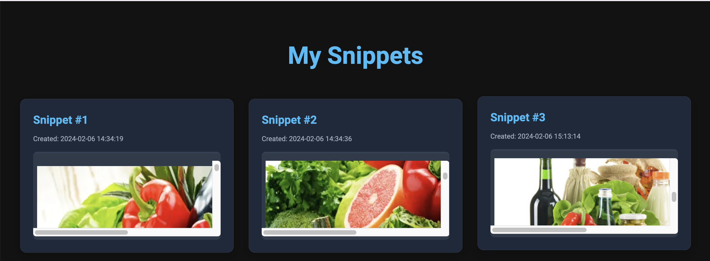

# Binary Beats IDE

**Binary Beats IDE** is an intuitive, powerful, online integrated development environment (IDE) designed to offer an accessible, seamless coding experience. Dive into our web-based editor for an unmatched coding journey, whether you're a beginner or a seasoned developer.

## Features ✨

- 📝 Edit HTML, CSS, and JavaScript in real-time with Monaco Editor
- 🚀 Run code snippets with a single click
- 💾 Autosave functionality to ensure you never lose your progress
- 🌐 Share your code with others through unique URLs
- 🔍 Zoom in/out functionality for better readability
- 🔄 Reset editor content to default values with a single click
- 🎨 Syntax highlighting and auto code suggestions for efficient coding

## Getting Started 🚀

To start using **Binary Beats IDE**, visit [Binary Beats](https://codesage.pythonanywhere.com) and log in with your credentials.

Experience a sleek, distraction-free coding interface:

## How to Use 🛠️

1. **Login/Register**: Access your personal workspace by logging in or registering.
2. **Write Code**: Choose between HTML, CSS, and JavaScript tabs to write your code.
3. **Run Code**: Use the 'Run Code' button to see your code come to life in the output pane.
4. **Save Snippets**: Click 'Save Code' to save your current work.
5. **Share**: Generate shareable links to showcase your work with others.

## New Features 🎉

- **Autosave**: Your code is automatically saved every 5 seconds, so you can focus on coding without worrying about losing your work.
- **Zoom In/Out**: Use keyboard shortcuts (Ctrl + 0 to zoom in and Ctrl + 9 to zoom out) to adjust the editor's font size for better readability.
- **Reset Editor Content**: Reset your editor's content to default values with ease, allowing you to quickly start fresh.
- **Syntax Highlighting and Auto Suggestions**: Enjoy a smooth coding experience with real-time syntax highlighting and intelligent code suggestions.

## Contributions 🤝

We welcome contributions from the community! If you'd like to contribute, please follow these steps:

1. Fork the repository.
2. Create a new branch (`git checkout -b feature-branch`).
3. Make your changes.
4. Commit your changes (`git commit -m 'Add some feature'`).
5. Push to the branch (`git push origin feature-branch`).
6. Open a pull request.

## License 📜

Distributed under the MIT License. See `LICENSE` for more information.

## Connect with Us 🌐

Got questions or suggestions? We'd love to hear from you! Reach out to us on:

- [GitHub](https://github.com/mhridoy/Binary-Beats-IDE)
- [LinkedIn](https://linkedin.com/in/mhridoy)

---

Made with ❤️ by [Binary Beats](https://codesage.pythonanywhere.com).
